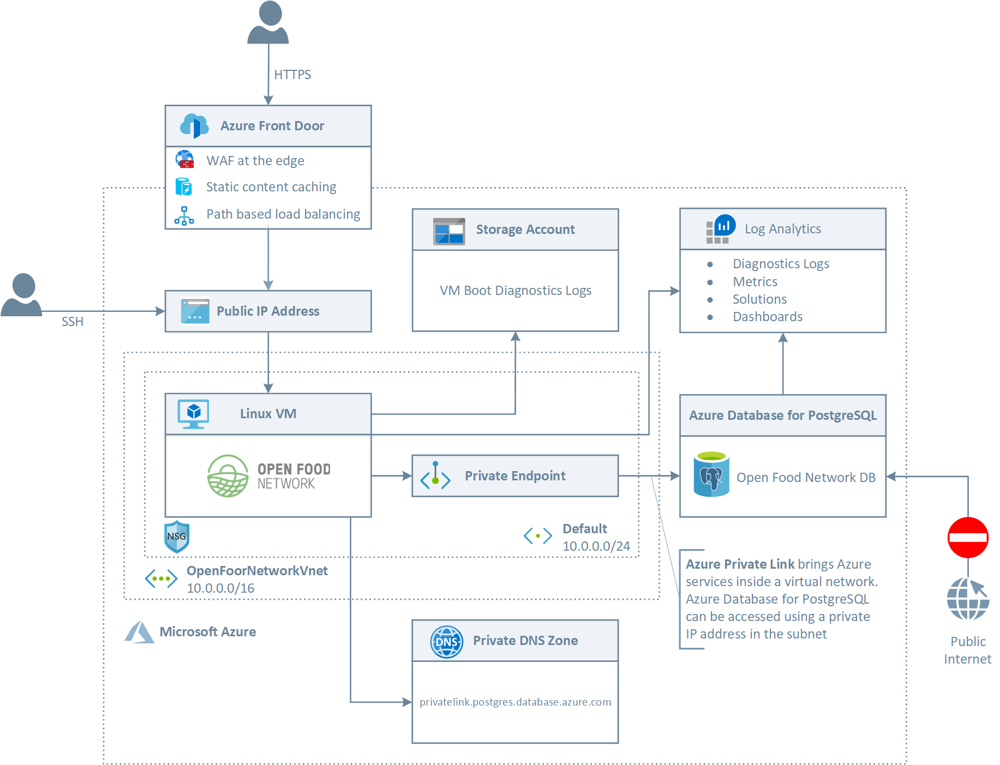
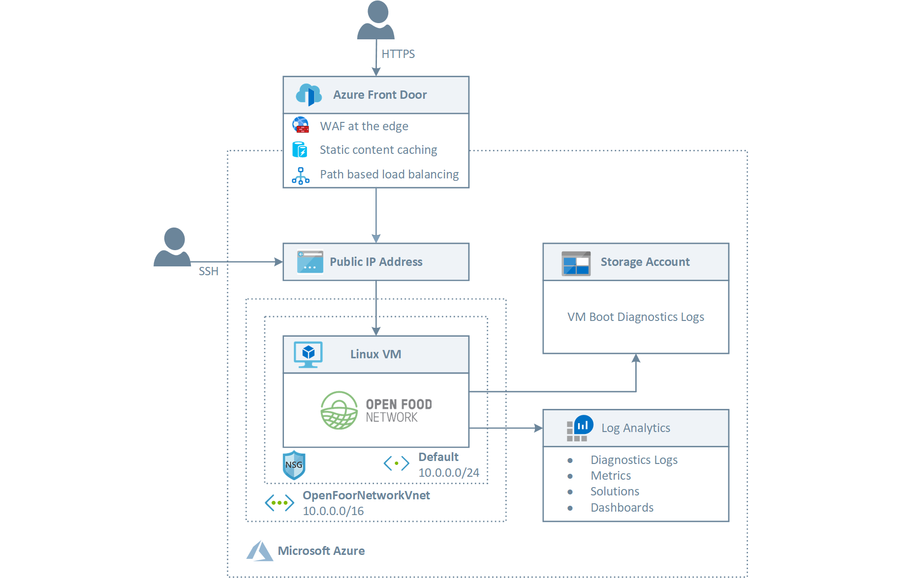

# Deploying Open Food Network to Azure #

This repository provides the [Azure Resource Manager templates](https://docs.microsoft.com/en-us/azure/azure-resource-manager/templates/overview) and [Bash](https://en.wikipedia.org/wiki/Bash_(Unix_shell)) scripts to automate the deployment of the [Open Food Network](https://github.com/openfoodfoundation/openfoodnetwork) (OFN) application server to Azure in the development or production environment. Founded in Australia in 2012, the Open Food Network (OFN) is a global network of people and organizations working together to build an open source platform that enables new, ethical supply chains. Food producers can leverage the [Open Food Network](https://github.com/openfoodfoundation/openfoodnetwork) solution to sell online, wholesalers can manage buying groups and supply produce through networks of food hubs and shops.

## Production Environment ##

The following picture shows the topology of the production environment deployed by the Azure Resource Manager (ARM) template.



The [Azure Resource Manager template](https://docs.microsoft.com/en-us/azure/azure-resource-manager/templates/overview) deploys the following resources:

- [Virtual Network](https://docs.microsoft.com/en-us/azure/virtual-network/virtual-networks-overview): this virtual network has a single subnet that hosts the Linux virtual machine. Virtual networks enable to create a traffic isolation boundary on the Azure platform. A virtual network is composed of a single or multiple virtual network segments, each with a specific IP network prefix (a subnet, either IPv4 or dual stack IPv4/IPv6). The virtual network defines an internal perimeter area where IaaS virtual machines and PaaS services can establish private communications.
- [Network Security Group](https://docs.microsoft.com/en-us/azure/virtual-network/security-overview): A network security group (NSG) is a list of security rules that act as traffic filtering on IP sources, IP destinations, protocols, IP source ports, and IP destination ports (also called a Layer 4 five-tuple). The network security group can be applied to a subnet, a network interface card (NIC) associated with an Azure virtual machine, or both. The network security groups are essential to control inbound and outbound traffic from subnets and virtual machines. The level of security afforded by the network security group is a function of which ports you open, and for what purpose. This network security group deployed by the ARM template contains inbound rules to limit the access to the virtual machine:
  - SSH: this inbound rule allows access on port 22
  - HTTP: this inbound rule allows access on port 80
  - HTTPS: this inbound rule allows access on port 443
- [Public IP](https://docs.microsoft.com/en-us/azure/virtual-network/virtual-network-public-ip-address): With some Azure features, you can associate service endpoints to a public IP address so that your resource is accessible from the internet. This endpoint uses NAT to route traffic to the internal address and port on the virtual network in Azure. This path is the primary way for external traffic to pass into the virtual network. You can configure public IP addresses to determine which traffic is passed in and how and where it's translated onto the virtual network. This is the Public IP of the Linux virtual machine hosting the OFN solution
- [Network Interface](https://docs.microsoft.com/en-us/azure/virtual-network/virtual-network-network-interface): A network interface (NIC) enables an Azure virtual machine to communicate with the internet, Azure, and on-premises resources. This is the NIC used by the Linux virtual machine that makes use of the Public IP.
- [Virtual Machine](https://docs.microsoft.com/en-us/azure/virtual-machines/windows/overview): Azure Virtual Machines (VM) is one of several types of on-demand, scalable computing resources that Azure offers. Typically, you choose a VM when you need more control over the computing environment than the other choices offer. An Azure VM gives you the flexibility of virtualization without having to buy and maintain the physical hardware that runs it. However, you still need to maintain the VM by performing tasks, such as configuring, patching, and installing the software that runs on it. This Ubuntu Linux virtual machine is used to host the Open Food Network solution.
- [Log Analytics](https://docs.microsoft.com/en-us/azure/azure-monitor/platform/design-logs-deployment): Azure Monitor stores log data in a Log Analytics workspace, which is an Azure resource and a container where data is collected, aggregated, and serves as an administrative boundary. Data in a workspace is organized into tables, each of which stores different kinds of data and has its own unique set of properties based on the resource generating the data. Most data sources will write to their own tables in a Log Analytics workspace. This Log Analytics workspace is used to monitor the health status of the Linux VM (optional).
- [Front Door](https://docs.microsoft.com/en-us/azure/frontdoor/front-door-overview): Azure Front Door (AFD) is Microsoft's highly available and scalable Web Application Acceleration Platform, Global HTTP Load Balancer, Application Protection, and Content Delivery Network. Running in more than 100 locations at the edge of Microsoft's Global Network, AFD enables you to build, operate, and scale out your dynamic web application and static content. AFD provides your application with world-class end-user performance, unified regional/stamp maintenance automation, BCDR automation, unified client/user information, caching, and service insights. The deployment of this resource is optional. When enabled, Front Door can be used to:
  - Requests acceleration
  - Static content caching at the edge
  - Dynamic compressions of MIME types
  - Static response caching at the edge
  - WAF policy at the edge to protect the web site from malicious attacks
  - SSL Termination
- [WAF Policy](https://docs.microsoft.com/en-us/azure/web-application-firewall/overview): Web Application Firewall (WAF) provides centralized protection of your web applications from common exploits and vulnerabilities. Web applications are increasingly targeted by malicious attacks that exploit commonly known vulnerabilities. SQL injection and cross-site scripting are among the most common attacks. This resource can be deployed along with Front Door.
- [Azure Database for PostgreSQL](https://docs.microsoft.com/en-us/azure/postgresql/): Azure Database for PostgreSQL is a relational database service based on the open-source Postgres database engine. It's a fully managed database-as-a-service offering that can handle mission-critical workloads with predictable performance, security, high availability, and dynamic scalability. The deployment of this resource is optional, but highly recommended to host the OFN database in a managed database which provides better scalability and resiliency compared to hosting the database in the same Linux virtual machine running the web site. This resource is the managed server hosting the darabase
- [Azure Database for PostgreSQL]((https://docs.microsoft.com/en-us/azure/postgresql/)): This is the OFN database hosted by the Azure Database for PostgreSQL managed server.
- [Private Link for Azure Database for PostgreSQL](https://docs.microsoft.com/en-us/azure/private-link/private-link-overview): Azure Private Link enables you to access Azure PaaS Services (for example, Azure Storage and SQL Database) and Azure hosted customer-owned/partner services over a [Private Endpoint](https://docs.microsoft.com/en-us/azure/private-link/private-endpoint-overview) in your virtual network. Traffic between your virtual network and the service travels the Microsoft backbone network. This resource is used to let the virtual machine hosting the OFN solution to access data hosted by the Azure Database for PostgreSQL server via a private IP address.
- [Private DNS Zone](https://docs.microsoft.com/en-us/azure/dns/private-dns-overview): Azure Private DNS provides a reliable, secure DNS service to manage and resolve domain names in a virtual network without the need to add a custom DNS solution. By using private DNS zones, you can use your own custom domain names rather than the Azure-provided names available today. You can use private DNS zones to override the DNS resolution for a particular [Private Endpoint](https://docs.microsoft.com/en-us/azure/private-link/private-endpoint-overview). A private DNS zone can be linked to your virtual network to resolve specific domains. For more information about Private Endpoints and Private DNS Zone integration, see [Azure Private Endpoint DNS configuration](https://docs.microsoft.com/en-us/azure/private-link/private-endpoint-dns)

For more information on how to deploy the Open Foor Network solution to a production environment, see [Deploy Open Food Network solution to a Production Environment](./docs/prod-env-deployment.md)

## Development Environment ##

The following picture shows the topology of the development environment deployed by the Azure Resource Manager (ARM) template.



The [Azure Resource Manager template](https://docs.microsoft.com/en-us/azure/azure-resource-manager/templates/overview) deploys the following resources:

- [Virtual Network](https://docs.microsoft.com/en-us/azure/virtual-network/virtual-networks-overview): this virtual network has a single subnet that hosts the Linux virtual machine. Virtual networks enable to create a traffic isolation boundary on the Azure platform. A virtual network is composed of a single or multiple virtual network segments, each with a specific IP network prefix (a subnet, either IPv4 or dual stack IPv4/IPv6). The virtual network defines an internal perimeter area where IaaS virtual machines and PaaS services can establish private communications.
- [Network Security Group](https://docs.microsoft.com/en-us/azure/virtual-network/security-overview): A network security group (NSG) is a list of security rules that act as traffic filtering on IP sources, IP destinations, protocols, IP source ports, and IP destination ports (also called a Layer 4 five-tuple). The network security group can be applied to a subnet, a network interface card (NIC) associated with an Azure virtual machine, or both. The network security groups are essential to control inbound and outbound traffic from subnets and virtual machines. The level of security afforded by the network security group is a function of which ports you open, and for what purpose. This network security group deployed by the ARM template contains inbound rules to limit the access to the virtual machine:
  - SSH: this inbound rule allows access on port 22
  - HTTP: this inbound rule allows access on port 80
  - HTTPS: this inbound rule allows access on port 443
- [Public IP](https://docs.microsoft.com/en-us/azure/virtual-network/virtual-network-public-ip-address): With some Azure features, you can associate service endpoints to a public IP address so that your resource is accessible from the internet. This endpoint uses NAT to route traffic to the internal address and port on the virtual network in Azure. This path is the primary way for external traffic to pass into the virtual network. You can configure public IP addresses to determine which traffic is passed in and how and where it's translated onto the virtual network. This is the Public IP of the Linux virtual machine hosting the OFN solution
- [Network Interface](https://docs.microsoft.com/en-us/azure/virtual-network/virtual-network-network-interface): A network interface (NIC) enables an Azure virtual machine to communicate with the internet, Azure, and on-premises resources. This is the NIC used by the Linux virtual machine that makes use of the Public IP.
- [Virtual Machine](https://docs.microsoft.com/en-us/azure/virtual-machines/windows/overview): Azure Virtual Machines (VM) is one of several types of on-demand, scalable computing resources that Azure offers. Typically, you choose a VM when you need more control over the computing environment than the other choices offer. An Azure VM gives you the flexibility of virtualization without having to buy and maintain the physical hardware that runs it. However, you still need to maintain the VM by performing tasks, such as configuring, patching, and installing the software that runs on it. This Ubuntu Linux virtual machine is used to host the Open Food Network solution.
- [Log Analytics](https://docs.microsoft.com/en-us/azure/azure-monitor/platform/design-logs-deployment): Azure Monitor stores log data in a Log Analytics workspace, which is an Azure resource and a container where data is collected, aggregated, and serves as an administrative boundary. Data in a workspace is organized into tables, each of which stores different kinds of data and has its own unique set of properties based on the resource generating the data. Most data sources will write to their own tables in a Log Analytics workspace. This Log Analytics workspace is used to monitor the health status of the Linux VM (optional).
- [Front Door](https://docs.microsoft.com/en-us/azure/frontdoor/front-door-overview): Azure Front Door (AFD) is Microsoft's highly available and scalable Web Application Acceleration Platform, Global HTTP Load Balancer, Application Protection, and Content Delivery Network. Running in more than 100 locations at the edge of Microsoft's Global Network, AFD enables you to build, operate, and scale out your dynamic web application and static content. AFD provides your application with world-class end-user performance, unified regional/stamp maintenance automation, BCDR automation, unified client/user information, caching, and service insights. The deployment of this resource is optional. When enabled, Front Door can be used to:
  - Requests acceleration
  - Static content caching at the edge
  - Dynamic compressions of MIME types
  - Static response caching at the edge
  - WAF policy at the edge to protect the web site from malicious attacks
  - SSL Termination
- [WAF Policy](https://docs.microsoft.com/en-us/azure/web-application-firewall/overview): Web Application Firewall (WAF) provides centralized protection of your web applications from common exploits and vulnerabilities. Web applications are increasingly targeted by malicious attacks that exploit commonly known vulnerabilities. SQL injection and cross-site scripting are among the most common attacks. This resource can be deployed along with Front Door.

For more information on how to deploy the Open Foor Network solution to a development and testing environment, see [Deploy Open Food Network solution to a Development Environment](./docs/dev-env-deployment.md)

## Artifacts ##

This repository contains the following artifacts:

```batch
|── docs           # Contains documents
|── images         # Contains images
├── scripts        # Contains Bash scripts to deploy the application and configure the VM
|── templates      # Contains ARM templates to deploy the Linux VM
```

## Get Started ##

If you're planning on contributing to the project, you can begin by forking this repository using the **Fork** button in the top-right corner of this screen. You should then be able to use git clone to copy your fork onto your local machine.

```bash
git clone https://github.com/YOUR_GITHUB_ACCOUNT/ofn-azure-install
```

Open the directory containing the local copy of the project:

```bash
cd ofn-azure-install
```

And then add an upstream remote that points to the main repo:

```bash
git remote add upstream https://github.com/paolosalvatori/ofn-azure-install
```

Fetch the latest version of the master btanch from the upstream repository:

```bash
git fetch upstream master
```
